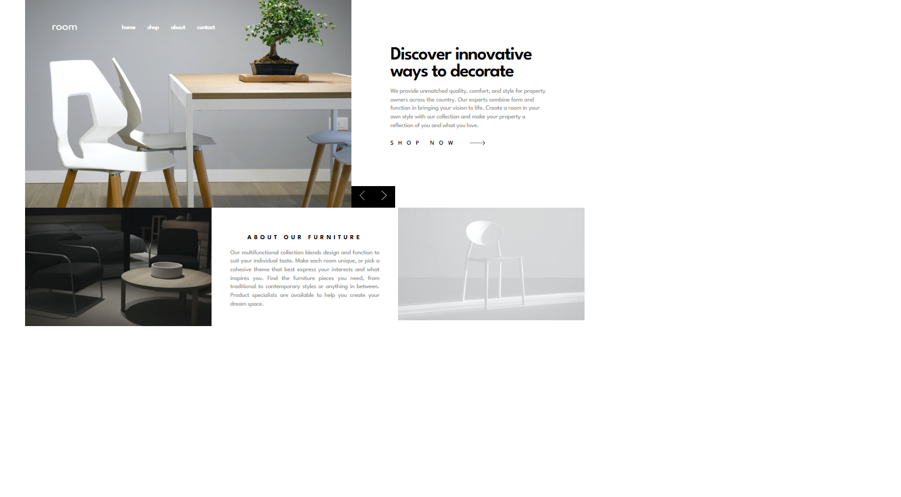

# Frontend Mentor - Room homepage solution

This is a solution to the [Room homepage challenge on Frontend Mentor](https://www.frontendmentor.io/challenges/room-homepage-BtdBY_ENq). Frontend Mentor challenges help you improve your coding skills by building realistic projects.

## Table of contents

- [Overview](#overview)
  - [The challenge](#the-challenge)
  - [Screenshot](#screenshot)
  - [Links](#links)
- [My process](#my-process)
  - [Built with](#built-with)
  - [Useful resources](#useful-resources)
- [Author](#author)

## Overview

### The challenge

Users should be able to:

- View the optimal layout for the site depending on their device's screen size
- See hover states for all interactive elements on the page
- Navigate the slider using either their mouse/trackpad or keyboard

### Screenshot

### Links

- Live Site URL: [Link](https://olaide-hok.github.io/room-homepage/)

## My process

### Built with

- Semantic HTML5 markup
- CSS custom properties
- Flexbox
- CSS Grid
- Mobile-first workflow
- [Sass](https://sass-lang.com/) - Sass is the most mature, stable, and powerful professional grade CSS extension.

### Useful resources

- [BEM and SASS: A Perfect Match](https://andrew-barnes.medium.com/bem-and-sass-a-perfect-match-5e48d9bc3894) - This helped with BEM and SASS. I really liked this pattern and will use it going forward.
- [Using Sass to Control Scope With BEM Naming](https://css-tricks.com/using-sass-control-scope-bem-naming/) - This is an amazing article which helped me finally understand BEM. I'd recommend it to anyone still learning this concept.

## Author

- Website - [Habeeb Kareem](https://habeeb-dev.netlify.app)
- Frontend Mentor - [@olaide-hok](https://www.frontendmentor.io/profile/olaide-hok)
